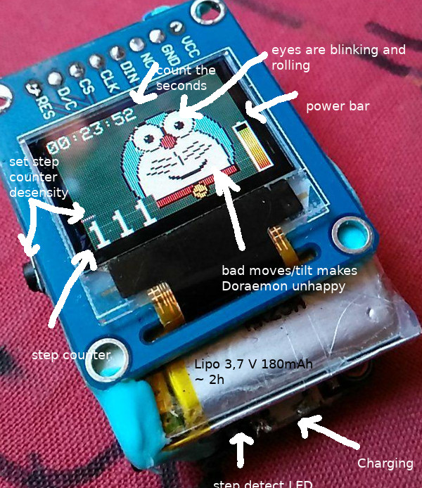

# DoraemonStepper

A feather M0 step counter with SSD1331 oled RGB display and MPU6050 gyroscope with Doraemon face.

## Features

  - 180mAh Lipo (display always on): 2h
  - Button to set a step desensity (level 1 to 15)
  - a kind of clock (not very precise)
  - power bar
  - step counter
  - every step: red LED on feather M0 board blinks
  - rolling eyes to the deepest edge
  - blinking eyes (every 4sec)
  - if you tilt it to you: mouth gets more frindly
  - if you tilt it rearward: mouth gets unfrindly

## Code

The code is realy ugly, but it has to work in a very short time.

## Picture

## Circuit

It is very simple: connect 3.3V and GND to MPU6050 board and SSD1331 display.
Add Lipo 3,7V (+red) to BAT (for USB chariging) and Ground (-black) to GND.
Add a power switch to the lipo, if you want. Add SCL (clock) and SDA (data)
to the I2C clock and data pins of your MPU6050 board. Add a button
to 11 and ground. Connect the SSD1331 Display to the SPI bus
(and use my modified adafruit lib) like this:

    OLED_DC       D5
    OLED_CS      D12
    OLED_RESET    D6
    DIN         MOSI
    CLK          SCK

